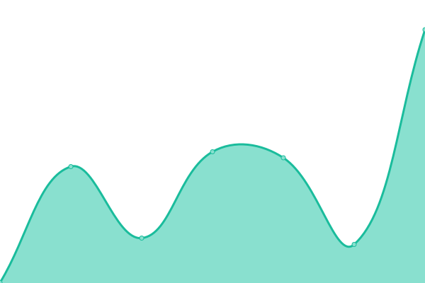
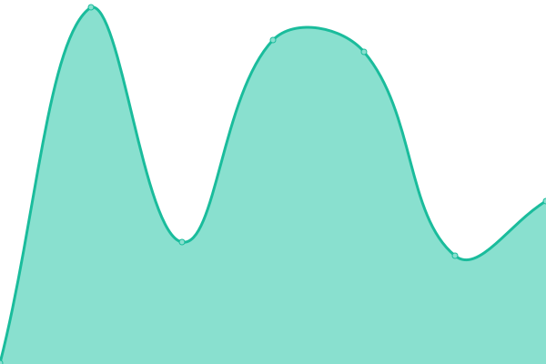
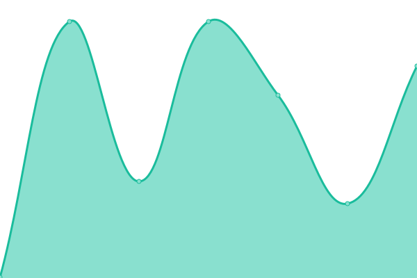
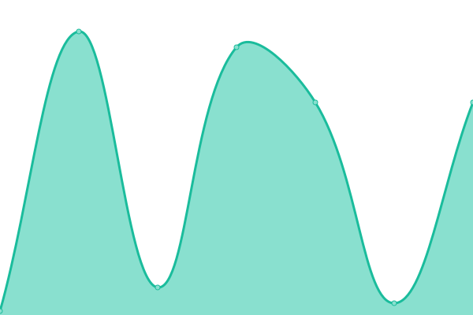

# [📈 Live Status](https://demo.upptime.js.org): <!--live status--> **🟧 Partial outage**

This repository contains the open-source uptime monitor and status page for [hegga-cl](https://demo.upptime.js.org), powered by [Upptime](https://github.com/upptime/upptime).

With [Upptime](https://upptime.js.org), you can get your own unlimited and free uptime monitor and status page, powered entirely by a GitHub repository. We use [Issues](https://github.com/hegga-cl/findie-upptime# The name of this repository/issues) as incident reports, [Actions](https://github.com/hegga-cl/findie-upptime# The name of this repository/actions) as uptime monitors, and [Pages](https://demo.upptime.js.org) for the status page.

<!--start: status pages-->
<!-- This summary is generated by Upptime (https://github.com/upptime/upptime) -->
<!-- Do not edit this manually, your changes will be overwritten -->
<!-- prettier-ignore -->
| URL | Status | History | Response Time | Uptime |
| --- | ------ | ------- | ------------- | ------ |
|  [findie prod](https://www.findie.cl/) | 🟩 Up | [findie-prod.yml](https://github.com/hegga-cl/findie-upptime/commits/HEAD/history/findie-prod.yml) | 

 233ms
     
 | 

<a href="https://hegga-cl.github.io/findie-upptime/history/findie-prod">100.00%</a>
    

|  [api prod](https://api-01.findie.cl/api/v1/freelancers/top_featured/) | 🟥 Down | [api-prod.yml](https://github.com/hegga-cl/findie-upptime/commits/HEAD/history/api-prod.yml) | 

 231ms
     
 | 

<a href="https://hegga-cl.github.io/findie-upptime/history/api-prod">0.00%</a>
    

|  [findie staging](https://staging.findie.cl/) | 🟩 Up | [findie-staging.yml](https://github.com/hegga-cl/findie-upptime/commits/HEAD/history/findie-staging.yml) | 

 339ms
     
 | 

<a href="https://hegga-cl.github.io/findie-upptime/history/findie-staging">100.00%</a>
    

|  [api staging](https://api-01.findie.cl/api/v1/freelancers/top_featured/) | 🟥 Down | [api-staging.yml](https://github.com/hegga-cl/findie-upptime/commits/HEAD/history/api-staging.yml) | 

 28ms
     
 | 

<a href="https://hegga-cl.github.io/findie-upptime/history/api-staging">0.00%</a>
    

<!--end: status pages-->

[**Visit our status website →**](https://demo.upptime.js.org)

## 📄 License

- Powered by: [Upptime](https://github.com/upptime/upptime)
- Code: [MIT](./LICENSE) © [hegga-cl](https://demo.upptime.js.org)
- Data in the `./history` directory: [Open Database License](https://opendatacommons.org/licenses/odbl/1-0/)
